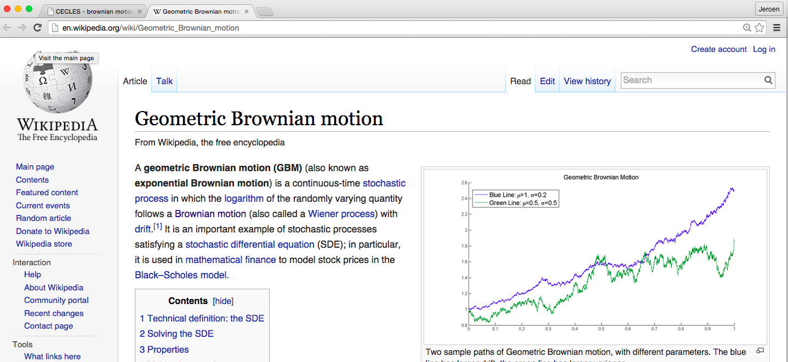

# System in Production

## Design of Cecles

- Graphical design
- Stephans mockups hier
- Martins template
- Information flow uit report

********** GEKOPIEERD UIT CECLES REPORT

This chapter gives a brief overview of the design of the system. 

## Information Flow
An overview of the basic information flow in CECLES can be found in the next chapter. Also future functionalities are addressed, which are elaborated in future work and the remainder of the report. 

### TU Delft API
The main source of information is the [TU Delft API](http://apidoc.tudelft.nl/). From this source the system extracts both the courses and users. From every course some basic textual in- formation can be retrieved as well as which user is enrolled in which course. From the basic textual information from each course the system will extract the main terms which results in topics relevant for each course. These topics can be used to search other sources.

### Wikipedia API
The [Wikipedia API](http://www.mediawiki.org/wiki/API:Main_page) enables CECLES to find relevant pages for the course. Again the topics extracted from the course information can be used for this matter.

### Coursera API
The [Coursera Catalog APIs](https://tech.coursera.org/app-platform/catalog/) expose the list of courses, instructors and universities available on the Coursera platform. These APIs are available publicly without authentication over the internet. These APIs are still beta and can change in backwards-incompatible ways without warning.

### CollegeRama
Some lectures at TU Delft are recorded to give students the possibility to watch the lecture online. From the information found at the TU Delft API we can easily connect these lectures to the courses by their course identifier.

### YouTube API
The [YouTube API](https://developers.google.com/youtube/v3/) enables the system to quickly search through YouTube videos in their description, keywords. For these searches the topics found with the textual analysis of the course will be used. Unfortunately it is not possible to search through subtitles, but these could be used for further analysis. Since we want to index the videos with CrowdFlower, we will need to split the video in smaller parts.

### GoogleScholar
Google Scholar does not have an API, but several alternatives (even unofficial API’s) can be found on the online. For example, a parser for the output of Google Scholar is available on [icir](http://www. icir.org/christian/scholar.html). This enables the system to retrieve relevant papers with the topics belonging to the course.

The system will retrieve and compute all information as mentioned above on beforehand and save it in the database so it can be quickly searched through according to the extracted topics per course.

## How Cecles works
Beschrijving functionalities cecles (evt verwijzen naar future work)
Bijv: hoe gestest obv google etc.
Screenshots
Use cases

### Authentication

### Welcome 

### Course Information

### Keywords

### Search

### Results

## Differences design and actual application
BESCHRIJVING VERSCHILLEN

## Future work
### Video segmentation

#### Simple heuristic segmentation
The segmentation of videos can be indexed by simple heuristics. Such a simple heuristic may be: under 5 minutes, do no segmenting and between 5 and 10 minutes cut the video in two parts, above 10 minutes in three same length parts and so on. The advantage of this method is its simplicity. However, with this method there is no assurance only one topic is addressed within a segment.

#### Scene detection within videos
Another option is to do operations on the video itself. There are multiple algorithms to do scene detection within videos [[1][1]]. The advantage is that results will probably be better than the simple heuristic method. The disadvantage is implementing this method will take a lot of time and the calculations are costly in terms of resources.

#### Detection by CrowdFlower user
The last option is to let the CrowdFlower user do the segmentation. When a user is well known to the topics, this would be a good option. However, as we are not sure about the knowledge of these users we dislike this option. Also, this option would make the user interface for the CrowdFlower users more difficult.
	
Based on above considerations, we have decided to use the simple heuristic segmentation.

[1] C.-W. Ngo, Y.-F. Ma, and H.-J. Zhang, Video summarization and scene detection by graph modeling, Cir- cuits and Systems for Video Technology, IEEE Transactions on 15, 296 (2005).
