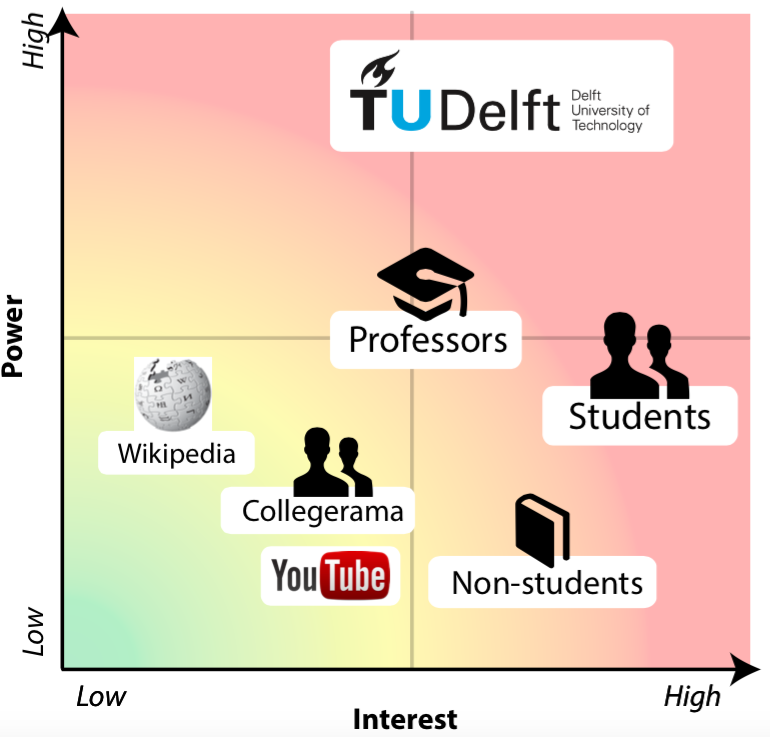
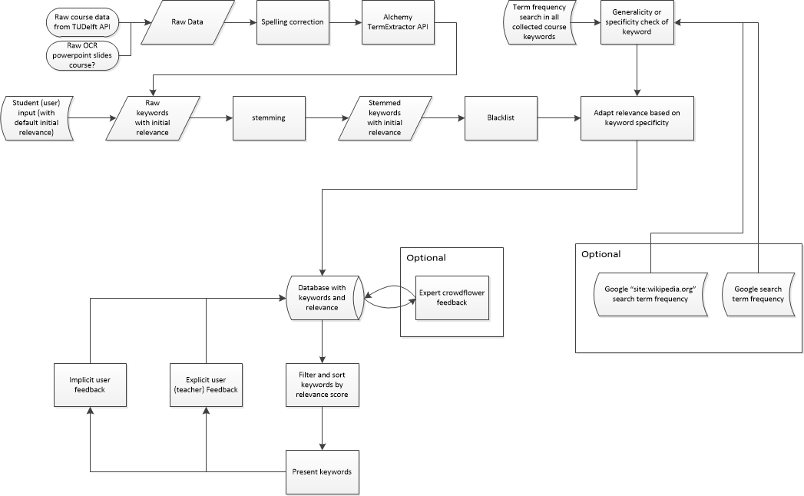
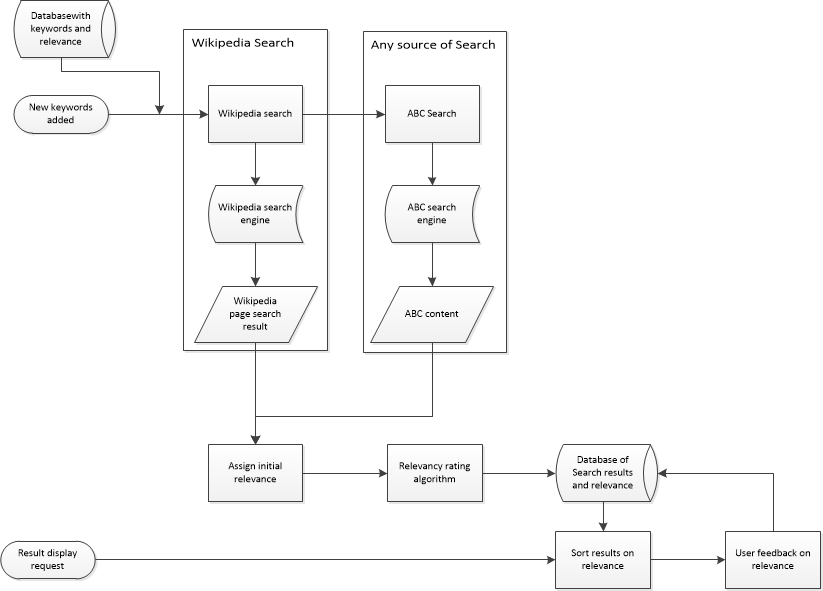
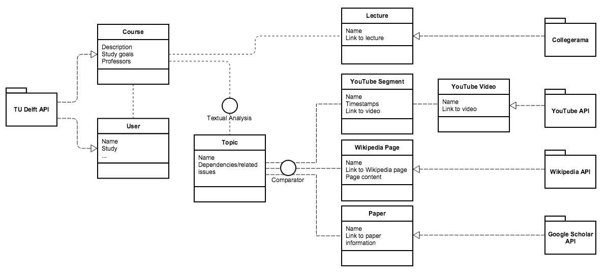
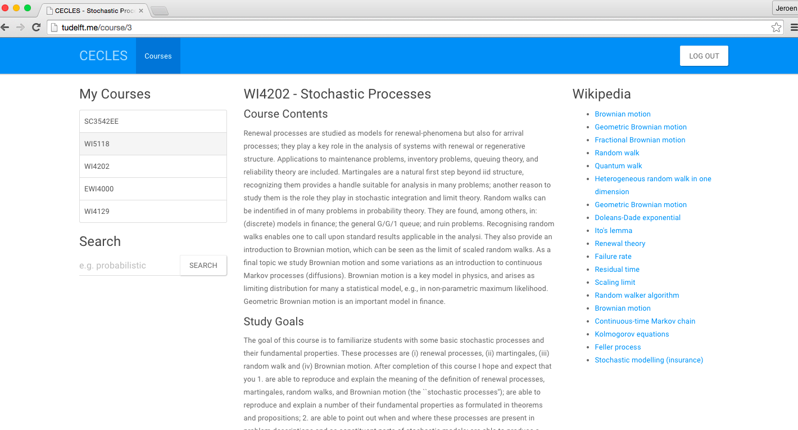
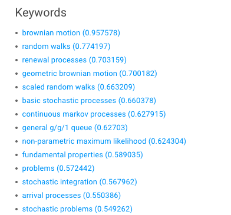
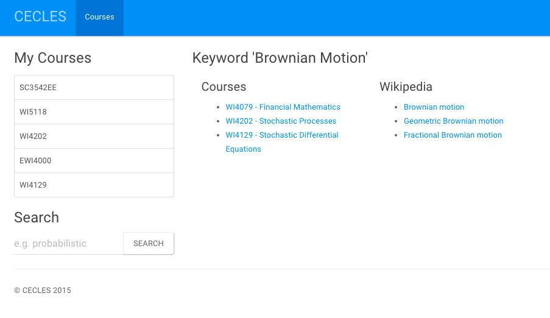
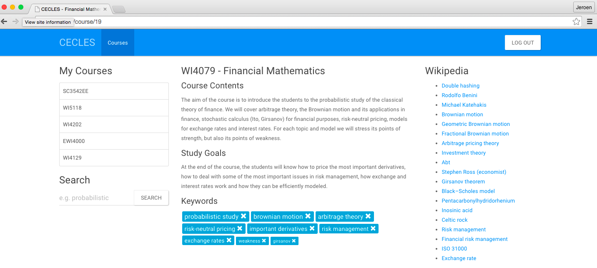

#Introduction

## What is Cecles
Cecles, the Collaborative Enriched Course Learning Experience System, is a platform for students that provides instant access to relevant information sources when studying for a course. It provides a customized environment for TU Delft students to quickly access all relevant course material on popular educational sites such as Wikipedia, Google Scholar, the TU Delft Collegerama and educational video channels on YouTube. 
The aim of the system is to reduce the time spent on searching for relevant course materials in different sources, a process which is known to be highly distracting to many students.

## Why Cecles
The learning system answers to a student’s need for information about topics of the course a student is enrolled in. It is built on the assumption that students like to consult a variety of sources when learning, such as the information given by the teacher as part of the course, recorded lectures of the course and as well as external sources like Wikipedia articles and educational videos on YouTube. Furthermore, we assume that students in a course have a homogeneous study information need and that the individual search operations are therefore redundant.
CECLES bundles these redundant search operations: Each time a student has a need for information on a topic, a search query is submitted throughout multiple systems. CECLES offers the results from multiple sources with its own customized search functionality.

## Challenges
In order for students to use this platform, it should provide a Pareto improvement on either time or relevance compared to the current situation. In other words, the platform should provide results that are more relevant within less time compared to a student using the search options of every individual source. The challenge in this application is to select relevant sources for each student. Some student might have problems with certain topics that are trivial for others.

## An information retrieval system
"Retrieving relevant information is one of the central activities in modern knowledge-driven societies. The real value of the Web can only be unlocked if the huge amount of available data can be found, analyzed, and exploited so that each user can quickly find information that is both relevant and comprehensive for their needs." ([Bozzon, 2015](https://blackboard.tudelft.nl/webapps/portal/ frameset.jsp?tab_tab_group_id=_10_1/))

The same goes for retrieving course material and additional information related to courses. The following steps are used for the information retrieval part. This will result in study information that can be quickly found and is both relevant and comprehensive for their needs.
* Derive main topics of courses from TUDelft API from description and study goals
* Analyze course topics with term extraction
* Finding similarities between courses
* Retrieving related information from external sources such as: YouTube, Wikipedia, Coursera and Google Scholar
* Future work: segmentation of YouTube videos, retrieving information of Collegerama by analyzing the accessory slides and segment the lectures by topic

Human computation and crowd-sourcing is mainly used for verification and the assessment for the relevance of the content. The human computation is used to directly review the content or keywords related to the course. Crowd-sourcing is used to predefine the materials offered.
* Rating of search results (external sources) relevant or irrelevant to ”learn” CECLES which results are useful. User feedback is used for assessing this relevance.
* The relevance of particular keywords in relation to courses are assessed with the use of CrowdFlower. The relevances is checked with the course description.
* Some future work regarding crowd-sourcing: Indexation of YouTube videos by segmentation of the video and using CrowdFlower to name the topics mentioned in each segment.

# Goals and aim of the system

## Goal of CECLES
The goal of CECLES is the combination of several aims. The aims of CECLES, as previously described in the introduction, are:

* Providing an overview of a course's learning goals and topics for enrolled students
* Providing a collection of relevant study material
* Reducing search times
* Reducing distraction when searching

Summarized in one sentence, the goal of CECLES is as follows:
> The goal of CECLES is to quickly provide accurate and relevant study materials for the topics given in a course a student is enrolled in.

## Stakeholder analysis
In the stakeholder analysis all individuals and groups that are affected by CECLES are described and their relationship with the CECLES project is explained.
The main stakeholders in this project are:
* Delft University of Technology 
* Professors
* Students
* YouTube
* Wikipedia
* Collegerama

In the Stakeholder Map below, a relative relation between interest and influence between individual stakeholders is shown. From this figure the relative importance of each stakeholders needs can be roughly determined.

The TU Delft as an organization has most power and a fair interest in the system. Student from the university have most interest. The system however, can be interesting for non-students as well, regarding to the open course development of the TU for example. 
The sources that are used have very little interest in the system itself but are important for the system since they provide (free) access to the data used.

## Requirements 
The requirements are set up using the MoSCoW method which follows RFC2119. The requirements are set up as must haves, should haves, could haves and would haves.

### Must haves
The must haves describes requirements that must be satisfied in the final system to achieve success
* The application must have all the up-to-date course guide information
* The application must extract relevant keywords from the course guide with a satisfying precision and recall
* The application must have the ability to compare the content of different courses
* The application must efficiently connect with Wikipedia to give information regarding specific topics

### Should haves
The should haves represent requirements that have a high-priority and should be included in the system if possible. These requirements are critical but can be satisfied in other ways if strictly necessary.
* The application should collect Collegerama lecture information
* The application should collect information from YouTube videos
* The application should link the course content to a particular video fragment and other (external) material
* The application should support tags gained from lectures
* The application should provide video fragments that can be assessed by CrowdFlower users to tag
those
* Other lectures should be recommended by making use of tags and the course guide

### Could haves
The could haves consist of requirements that are desirable but not necessary. This will be included if time and resources permit.
* An extended search functionality could be available
* The application could provide a place to ask course related questions and get closely related videos at specific parts
* The materials could have references to other lectures or course materials
* A student could be able to request notes or materials
* The application could have the ability to merge lectures of different years and could identify changes over time

## Non functional requirements
### Must haves
* CECLES should be fast and responsive

### Should haves
* The interface should be appealing to the user
* The interface should be intuitive
* The interface should be clean and concise
* The courses feedback and resources should be easy to find

### Could haves
* The system could be secure.
* The system could be stable.
* The system could be easily operable for system administrators.

### Would haves
* The system solely works for the TUDelft, it would be nice to make it portable to different universities or communities.

The system should be clean and concise: the constraints that comes with this requirement is further explained in the system analysis chapter. 
Security is of course a important issue when working with personal information. The system however, is considered to already have a safe login (working with the TU API). 
The security is, for now, less important since all sources used are public sources. 
Stability is in this phase less important. A little downtime is not such an issue. However, when widely used, it should handle peak load during examination periods.

## Use cases
The following use case diagram is made to illustrate the interaction with the system. The actors are the user (student) and a member of the teaching staff ('teacher', either a professor or other qualified teacher).

** Use Case Diagram**

### The student
The student is this use case is registered at the TU Delft and enrolled for courses. He or she has the intention to use CECLES as a tool to find more study materials based for the courses the student is already enrolled in.

### logging in 
The student is able to provide credentials (the TU Delft NetID) to log in. Thanks to the TU Delft API (not depicted) CECLES can read which courses the student is enrolled in and thus interested in.

### presenting keywords
The course database uses this information from the login to show only the courses the courses the student is interested in and the keywords that mach these interesting courses. The student can 'remove' keywords that are not relevant for him or her. This removal is considered to be a downgrade in relevance for the keyword and remembered for the next time.

### keyword validation
An alternative method of validating course keywords is by having a teacher (preferably of the course itself) look over the keywords and judge whether these are represenative of the course content.

### learning material
The learning material based on the (validated) keywords is presented to the student who can now start learning.

### teacher
The member of the teaching staff is able to provide feedback on the relevancy of the keywords for the course. more on this in **[link to chapter HC]**

# System Analysis
The system analysis chapter is dedicated to explain the functionality of the CECLES system. This chapter is split in two mains sections, the keyword pipeline and the results pipeline. Both processes are developed to generate results as relevant as possible for students. The keyword section is split from the results process because their approach differ. The keywords pipeline is based on theoretical and expert-based operations. The results pipeline, on the other hand, is reflected on user input. 

##The keyword pipeline
This section provides information on how the keyword processing in CECLES is planned. Not all of the features presented here will be functional in the prototype that is presented with this report. However, for explanational purposes in this document it is assumed that all features are already present.

### Relevance
In this pipeline focuses on delivering keywords that represent the course contents best. Therefore, 'relevance' in this section is defined to be the 'measure' by which a keyword is representative of the course contents whilst being specific enough to have meaning.

###Keyword Processing Diagram

###Sources
For the initial CECLES application the course data from the TUDelft API is used. To extend the course description and also for increasing the amount of keywords that are extracted, additional sources like the OCR data from the Colegerama slides should be used. This is intended to improve the relevance of the keywords that are used for querying.

Because even at the TU spelling errors are quite common, an initial spelling check on all course descriptions and goals is performed.

### AlchemyAPI
AlchemyAPI is a semantic analysis tool which supports a computer’s ability to understand human language and vision via an SaaS API. It integrates advanced text mining and computer vision functionality into Cecles' data-processing pipeline. [AlchemyAPI](http://www.alchemyapi.com/)

### Text analysis
Since Alchemy already does a large part of the analysis, stemming is the action most performed after the term extraction. Stemming is done because after testing several queries, overlap was found between several keywords (not yet in the results). 

The keywords are then compared to a blacklist. This list consists of insignificant of simplistic words. Also, since CECLES supports users' input, the blacklist holds inappropriate words.

### Score model
The score model consists of several techniques to obtain different factors for determining the relevance of the keywords. Currently the most important initial score factor is the check to keywords of all collected courses. Also the keywords can be used in a Google or Wikipedia search. Keywords that have too many results are seemly too generic. Containing too less results can indicate misguided terms. A test on querying the keywords on Google proved a reduction of irrelevant keywords by almost 40%
The score model has yet to be completed with additional techniques.

If a part of the keywords cannot be examined could be processed with the help of Crowdflower. If Crowdflower already has to be deployed in the process of keyword operations has still to be determined. 

### The User
When the keywords are extracted, scored on their relevance and sorted and filtered by eg. relevance they can be used for generating queries. Whether the right keywords are extracted is among others examined by the users' feedback. 

Relevance feedback is typically used for query expansion during short-term modeling of a user's immediate information need and for user profiling during long-term modeling of a user's persistent interests and preferences. Traditionally feedback methods require explicit feedback given by, for example, voting a plus or a minus. Such relevance feedback methods force users to engage in additional activities beyond their normal searching behavior [(Kelly,	2003)](http://people.csail.mit.edu/teevan/work/publications/papers/sigir-forum03.pdf). To limit this 'costs' for the user in the keyword part, CECLES focuses primarily on implicit feedback. In this way in the parts that require explicit feedback most, the effectiveness of explicit techniques will remain well.

With implicit feedback click rates, conversions and bounce rates are used to re-rank the keywords in the score model  (or in the sort and filter step). With explicit feedback the user is asked to assess the keywords on their relevance. 
Also, when a user thinks a relevant keyword is missing he or she can submit additional keywords. These inputs will then be checked with the blacklist and put in the score model.

#### Implicit feedback
The implicit user feedback consists a.o. of the click behavior of the student. When a result is used a lot, the relevance score will increase. This results in the most 'popular issues' at the top of the page. The more specific issues or subjects will descend to the bottom or next pages. A model should determine the proper weights and a future feature could be to categorize the topics of the course so all the topics will still be significantly represented on the first result page.

#### Explicit feedback
Since the user interface has to be as clean as possible, not to burden the student with all kinds of feedback requests, the user will not be asked for feedback in this phase. How students and teachers can provide additional feedback will be explained in chapter 6: human computation. 
This is as mentioned in the beginning of this paragraph. Instead of asking the student, an expert's feedback is used. Teachers can see the courses they teach and have the possibility to up vote and down vote the keywords of his/ her courses as well as other courses. Since they are experts it is assumed that they will not 'spam' or  misinterpret those keywords. Therefore this feedback will get a high weight factor. 

## The result Pipeline
This section provides information on how the results are processed in the CECLES application. The results process in sequence with the keyword result process. The results obtained from (potential) sources other than Wikipedia are annotated with ABC. All the results get an initial relevance score based on the keywords used to search for those results. More important is the feedback that will determine the relevance of the results.

### Result Processing Diagram

### Sources
The results that are used as additional materials for TU Delft courses are queried with the use of keywords described in the previous section. This process will executed every couple of weeks in the first phase to weekly or daily depending on the future features and sources used. 
The results are sorted by relevance for the course. In the working example only the Wikipedia pages are shown. When multiple sources are shown the sources will be ranked and sorted on the average relevance of the results.

### Results
The results have a relevance based on among others: the keywords used, the content in the course guide and the content of the source. When displayed on the course section, the user gives feedback on the results.

#### Implicit user feedback
Same as the feedback on keywords, the implicit user feedback consists a.o. of the click behavior of the student. This feedback is used to adjust the relevance score of the results. This is an important indicator of the usefulness of a result in relation to the course. In the end, the users, students, are those who actually use the result and therefore this feedback will have a significant weight.

#### Explicit user feedback
Other than with the explicit feedback on the keywords, on the results this is a good way to obtain the relevance of a result. This will also help to prevent unpopular results because of a cold start issue. When a user considers a result to be irrelevant, he or she can downgrade a result or up-vote it when considered as very relevant.
Since some users find results not relevant where others are exactly looking for those, both implicit and explicit feedback are important. It is not desirable to delete results because a first users rates a result irrelevant.

#### Expert feedback
For the relevance of the results the user feedback is most important. This means that the users probably know best what topics they find difficult. However, for the correctness of the provided materials an expert can become important. A teacher can check whether the provided materials provide correct information. Also he or she can annotate if the materials cover the course, in terms of difficulty, for example. An expert can than delete content if it does not fit into the course.

# System in Production

## Design of Cecles

This section describes the design of Cecles. This design includes the visual and the information design. Because the application is built incrementally, the first design was a light, easy to communicate design. After the concept was clear the production and design went hand in hand resulting in less preliminary explicit designs.

### Visual design
The mock-ups below show the initial visual design of the application. These mock-ups helped to get a first feeling on the UI of the application and to communicate the first stage of the application.

As can be seen in the remainder of this chapter, the actual design differs from this visual. This was indeed not the purpose of the mock-ups as we aimed for a good usability with proper functions instead of a focus on design.

## Information Flow
An overview of the basic information flow in CECLES can be found in the next chapter. Also future functionalities are addressed, which are elaborated in future work and the remainder of the report. 

This diagram describes an early design. Although not all functionalities with the eventually established requirements, it gives a clear overview of the information structure of the application.

### TU Delft API
The main source of information is the [TU Delft API](http://apidoc.tudelft.nl/). From this source the system extracts both the courses and users. From every course some basic textual in- formation can be retrieved as well as which user is enrolled in which course. From the basic textual information from each course the system will extract the main terms which results in topics relevant for each course. These topics can be used to search other sources.

### Wikipedia API
The [Wikipedia API](http://www.mediawiki.org/wiki/API:Main_page) enables CECLES to find relevant pages for the course. Again the topics extracted from the course information can be used for this matter.

### Coursera API
The [Coursera Catalog APIs](https://tech.coursera.org/app-platform/catalog/) expose the list of courses, instructors and universities available on the Coursera platform. These APIs are available publicly without authentication over the Internet. These APIs are still beta and can change in backwards-incompatible ways without warning.

### CollegeRama
Some lectures at TU Delft are recorded to give students the possibility to watch the lecture online. From the information found at the TU Delft API we can easily connect these lectures to the courses by their course identifier.

### YouTube API
The [YouTube API](https://developers.google.com/youtube/v3/) enables the system to quickly search through YouTube videos in their description, keywords. For these searches the topics found with the textual analysis of the course will be used. Unfortunately it is not possible to search through subtitles, but these could be used for further analysis. Since we want to index the videos with CrowdFlower, we will need to split the video in smaller parts.

### GoogleScholar
Google Scholar does not have an API, but several alternatives (even unofficial API’s) can be found on the online. For example, a parser for the output of Google Scholar is available on [icir](http://www. icir.org/christian/scholar.html). This enables the system to retrieve relevant papers with the topics belonging to the course.

The system will retrieve and compute all information as mentioned above on beforehand and save it in the database so it can be quickly searched through according to the extracted topics per course.

## How Cecles works

### Authentication

The Authentication should be done by Oauth. In the working example the login is done with a sample login. When the Oauth login works, the student automatically sees the courses he or she is enrolled in and can directly search for extra content

### Welcome 

After login already suggestions are made on courses, topic and relating sources. Also the user can scroll through his or her courses and search on topics.

### Course Information

The course page contains the description and study goals extracted from the TU api. The keywords are then extracted from the course guide. For now the user has the possibility to rate the keywords as irrelevant. Further analysis can result in adding a positive rating as well

### Keywords

The keywords are extracted from the courses as described in the system analysis. The keywords are graded by relevance as shown in the first screen shot (the relevance model is described in the system analysis chapter). The second screen shot shows the keywords as presented to the user in the application. 

### Search

When a student needs information on a particular topic, he or she can search directly on a keyword. All relevant courses and materials are shown.

### Results

Students can consult different resources. From wikipedia for a quick explaination to a Coursera course for a profound exploration.

## Future work
Much of the future work is already elaborated on in this report. Since we considered it more important the explain future work in the category of the content, only functions that are not mentioned in the remainder of the report are described in this section.

### Video segmentation

#### Simple heuristic segmentation
The segmentation of videos can be indexed by simple heuristics. Such a simple heuristic may be: under 5 minutes, do no segmenting and between 5 and 10 minutes cut the video in two parts, above 10 minutes in three same length parts and so on. The advantage of this method is its simplicity. However, with this method there is no assurance only one topic is addressed within a segment.

#### Scene detection within videos
Another option is to do operations on the video itself. There are multiple algorithms to do scene detection within videos [[1][1]]. The advantage is that results will probably be better than the simple heuristic method. The disadvantage is implementing this method will take a lot of time and the calculations are costly in terms of resources.

#### Detection by CrowdFlower user
The last option is to let the CrowdFlower user do the segmentation. When a user is well known to the topics, this would be a good option. However, as we are not sure about the knowledge of these users we dislike this option. Also, this option would make the user interface for the CrowdFlower users more difficult.
	
Based on above considerations, we have decided to use the simple heuristic segmentation.

[1] C.-W. Ngo, Y.-F. Ma, and H.-J. Zhang, Video summarization and scene detection by graph modeling, Cir- cuits and Systems for Video Technology, IEEE Transactions on 15, 296 (2005).

# Information Retrieval
This chapter takes a more theoretical view on the IR processes that are included in CECLES to support the system analysis and the application description.

## AlchemyAPI
CECLES uses the AlchemyAPI early on for the extraction of terms from the course guide. Although easily implemented and bringing back useful results, the Alchemy is a proprietary system and does not disclose exactly which algorithms are used. 
However, from the description it is possible to assume that Alchemy performs semantic analysis of text and tokenization. It also has a 'relevancy score' from 0 to 1 for each keyword extracted which is based on the text analyzed. Yet this the algorithm computing this score is, like before, a black box [AlchemyAPI][1].

## Stemming
Stemming, the process by which words are reduced to their stem, is currently not implemented in CECLES. 
The system could benefit from such an implementation since some keywords in CECLES are a more specific instance of another keyword (e.g. "self-adjoint operators" and "unbound self-adjoint operators"). 
These keywords are partially overlapping in their representation of the course contents.
However, implementing such stemming might reduce specificity of a keyword and therefore reduce the relevancy of later retrieved study material. 
This is a dilemma which needs to be resolved though trial-and-error with user feedback.

## Recommender system
The recommender system, although not implemented in this version, will suggest additional courses one can follow. The first step will be to implement a item-based recommender. Since this kind of collaborative filtering is easier to implement, this mostly is a god method to start with, so testing on the recommendations can be performed, for example. This already is a nice addition to the content-based recommendation the application uses right now in a way (similarities) based on the course guide). The last step to implement recommendations is to identify identical students based on the courses they follow and the issues they encounter. At this moment, when the TU authentication works, students can be identified based on the study and the courses they are enrolled into. The addition of user-based recommendation is that the similarity of students do not have to be assumed by the study they follow. Therefore unexpected connections between students taking different courses and study programs can be found.

## IR architecture
The IR architecture of CECLES has been partially discussed before, but this section tries to frame it within the theoretical paradigms of the discourse. 

### Pulling or pushing information
The system of CECLES tries to provide information on demand, which is an information pull to the eye of the user. On the back hand however, the search queries have already been processed and partially ranked before the user searching for them. Depending on the point of view, the information can also be considered to be pushed to the user since the user only has to change its filters.
However, the user should get the impression that the search is rather pulled instead of pushed.

### Precision - Recall
Precision, the retrieval of the most relevant documents, and recall, the retrieval of all relevant documents, is also a part of the IR architecture. The goal of CECLES is to provide relevant documents, yet pages of the system have limited information capacity. Therefore, it is beneficial to only show the most relevant documents and aim for higher precision than recall.

### Location of Computation
CECLES is currently designed to be a centralized (one node) information retrieval platform. The queries are, to a certain degree, predefined which allows to pre-execute them (asynchronous search). Also, the searches itself are not executed by the system: CECLES uses external search APIs to retrieve the relevant study material. 
Both the predefined queries and the asynchronous search operation save computation power and allow for such a thin architecture.

[1] http://www.alchemyapi.com/products/alchemylanguage/keyword-extraction

# Human Computation in CECLES
This chapter is dedicated to the description of the human computation element in CECLES. A partial aim of the system is relevancy, which is a subjective term **[source]**. Therefore, human feedback is required in the system to provide measurements of the relevancy.

In CECLES, there are two measures of relevancy which require human computation: the relevancy of a keyword for a specific course and the relevancy of study material for a specific keyword. 

As derived from the goal of CECLES, solely the most relevant results should be presented to the user of the system.

## Keyword relevance
This section builds on the keyword pipeline previously discussed in chapter 3: System Analysis. The keywords receive a computed relevancy from the AlchemyAPI algorithm based on the source of extraction (e.g. the course description). 
This relevancy is treated as 'base' relevancy and improved by three instances of human feedback: a moment of feedback by the teacher(s) of the course, a feedback by the students enrolled in the course and 'human computation'. The sections are based on the 'how, what and who' of human computation ([Law, E., & Ahn, L. V.,2011][1]).

### Expert feedback: professor/ teacher
The teacher is assumed to have an interest in the course and providing good and relevant study material for his or her students. As a result, the teacher is able to provide feedback on whether the keywords extracted and ranked from the course description correctly represent the course as he or she teaches it. This feedback is considered to be expert feedback and is rated higher than other feedback but at the same time there is a limited amount of people able to provide this feedback.

### User feedback: students
The second group of people able to provide feedback on the keywords are the students. For this group, the following is assumed: First, students have a low interest in providing direct and detailed feedback. Second, the students enrolled in the same course are homogeneous in their study needs, which results in the same definition of for each student of a course. Finally, students want a working system to work with. 

Based on the assumptions the feedback design for the students is as follows: students are presented the top keywords for a course and have the ability to remove keywords from their view. This 'removal' is interpreted by the system as a downgrade in relevancy.

Also, based on the final assumption, at least one round of human feedback other than the user feedback is required before students are willing to use the system. Such a 'cold-boot' must be done by the expert feedback or the human computation of CrowdFlower.

### Human computation: CrowdFlower
CrowdFlower is a human computation platform which provides services such as sentiment analysis, relevance tuning and content moderation or custom designed services which can be asked to broad or very specific 'contributors' (the people executing the tasks) [source](http://www.crowdflower.com/overview). 

The design of the feedback scheme at CrowdFlower needs to be more specific than with the teachers or the students since the incentive here is not, respectively, intrinsic motivation or use of the system. The incentive is financial reward. 

The task given to CrowdFlower will be: 
> "Is this keyword a good reflection in the contents of the course described above?"

this question has the limitation of being very dependent on the course guide description.

## Search result relevance
After determining relevant keywords for the courses, these keywords are used to search for study material. The IR components of such retrieval is described in chapter **[verwijzing]**. However, not only accurate, but also relevant materials are required which, again, requires human computation.

The search result relevance is given an initial value after which users can provide implicit and explicit user feedback **[reference to chapter 3]**. The explicit feedback is given by asking for a rating of the material (e.g. thumbs up- or down). The implicit feedback is given by tracking click- and bounce rates though the material.

## CrowdFlower task
To show test the applicability of CrowdFlower as a tool for rating the keywords we have created a task in CrowdFlower for a few, randomly selected courses.

### Job building
The job would have the following title and instructions:

> **Title:** Does the keyword represent the course contents?

> **Instructions:** To help label course descriptions for a university, you are provided with course descriptions and several keywords that have been extracted from this description. Please rate  whether the keyword is a good representation of the course contents

The worker would then be presented with the full text course guide description and the study goals and would have rate how well a keyword reflects the contents of the course.

**image of CF question **

### Test questions
To make sure that only competent workers can contribute, test questions have been built in. 
These were of the same structure as the keyword questions, but contained the course name instead of a keyword. 
The assumption was made here that the name of the course would very well reflect the contents of the course and thus workers would have to grade this question with a 4 or 5 in order to pass.

### Job Settings
The final step before launching is the settings of the job. To stay withing a low-budget, only 12 courses with each 7 keywords have been tested by 3 workers each. The job costs $8 total, which was within our $10 dollar budget we provided to CrowdFlower.

### Rating of workers
The workers behind CrowdFlower also had the ability to indicate their satisfaction about the job. The feedback was generally O.K. with an overall 3.9 out of 5. The worst sub-score was on the 'ease of job', which received 3.4 out of 5. 

**Image CF_contributor_rating.png **

### Results
The result from the task are presented as the average score on a keyword followed by the variance on that score. The image below is an illustration of such a result. The first column is the score on keyword 1 of a course, the second the variance of the score. Every row is a different course.

**image: CF_results.png **

### Conclusion of CrowdFlower
The results from CrowdFlower seem pretty alright but might need to be correlated to the relevancy scores retrieved from the AlchemyAPI to see if there is truly new information in doing the human computation. 
The task was rated alright by the workers contributing to the task, however, at the total cost of $8 for just a fraction of the total keywords, rating all keywords this way is quite expensive.

[1] Law, E., & Ahn, L. V. (2011). Human computation. Synthesis Lectures on Artificial Intelligence and Machine Learning, 5(3), 1-121.

